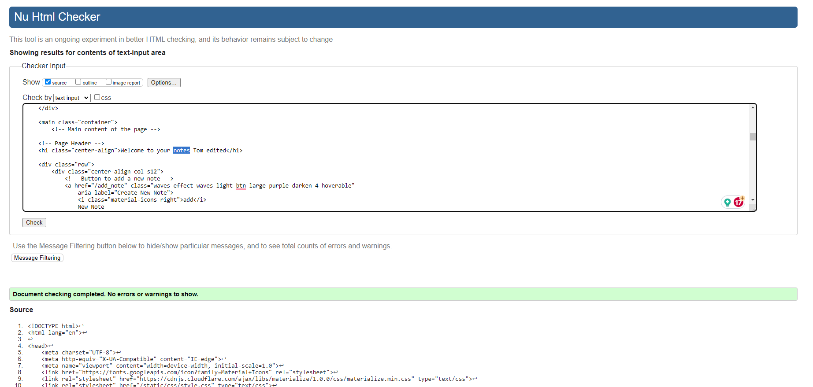
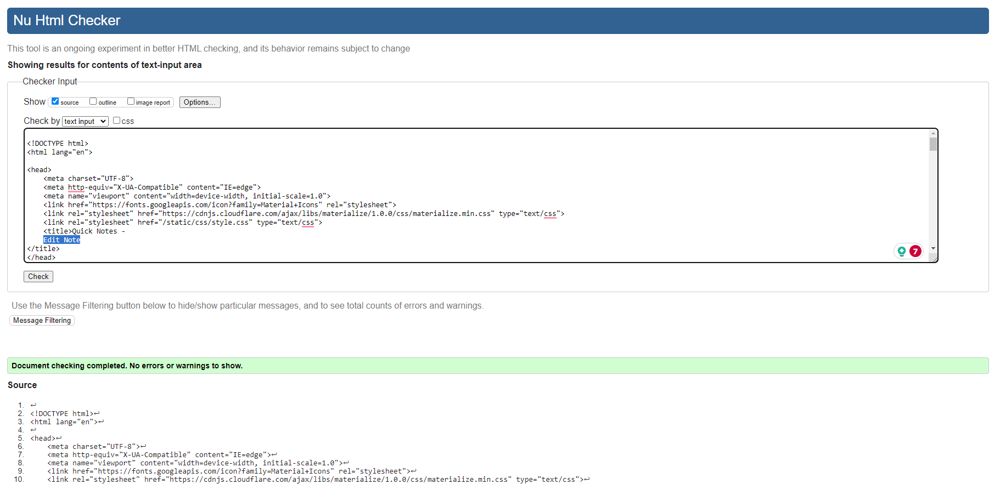
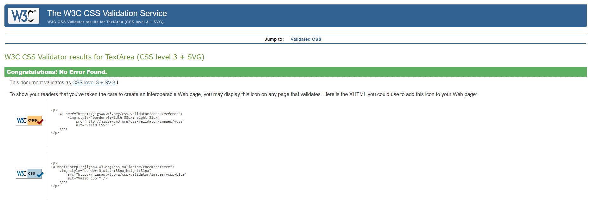
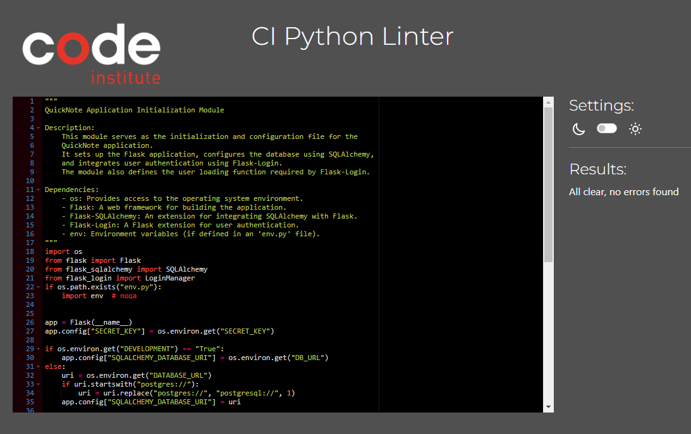
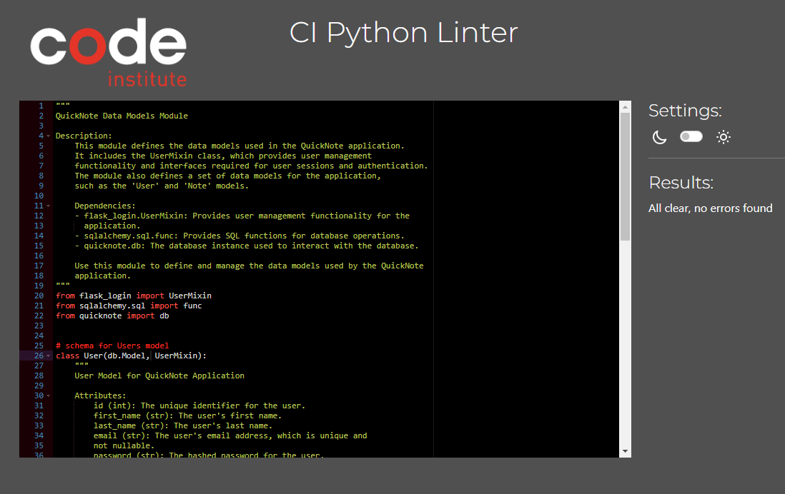
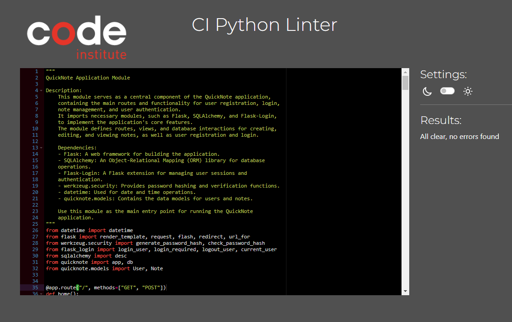
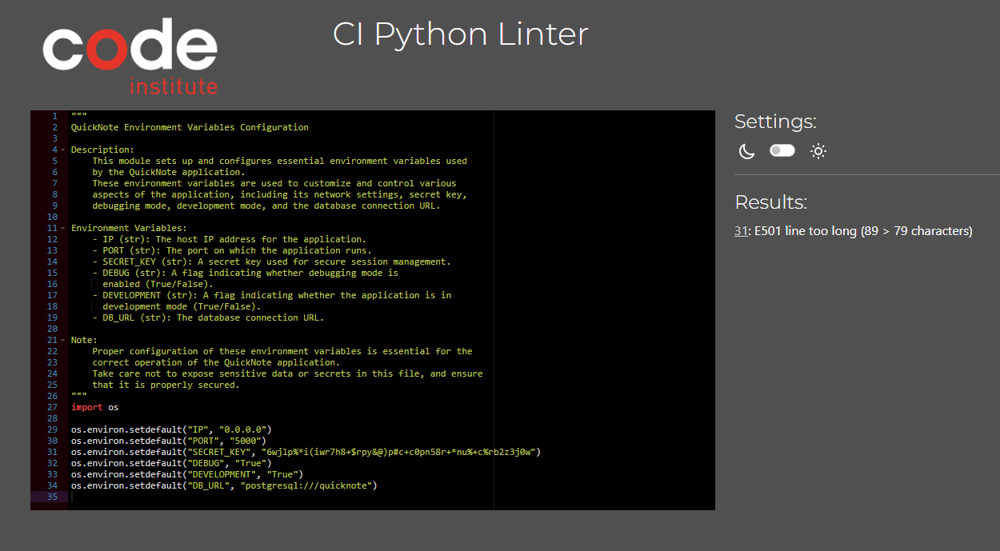
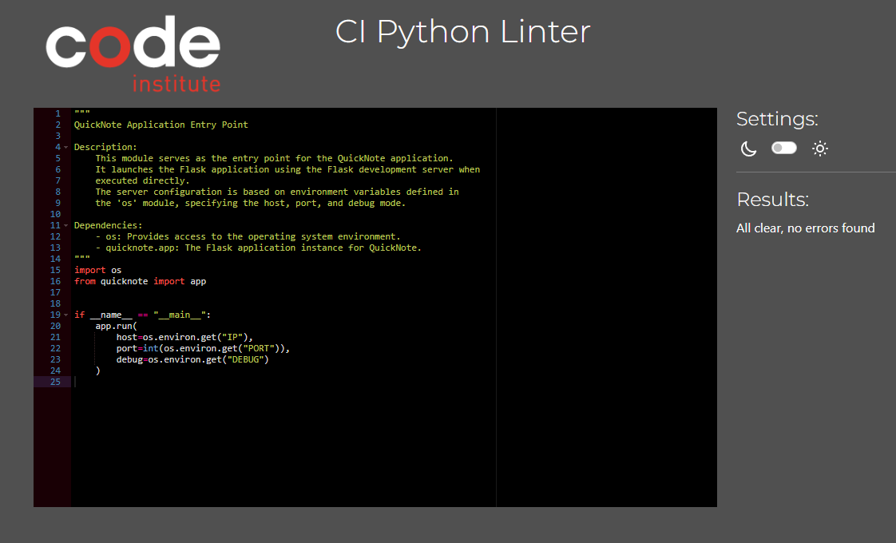

# QuickNotes

This Flask-based web application was developed to offer users a swift, simple, efficient, and secure online platform for storing notes.

[View the Live project here](https://quicknote-milestone3-ci-b9aeeb595db7.herokuapp.com/)

## Table of Contents
1. [User Experience](#user-experience)
2. [Features](#features)
3. [Design](#design)
4. [Technologies Used](#technologies-used)
5. [Deployment and Local Development](#deployment-&-local-development)
6. [Testing](#testing)
7. [Credits](#credits)

## User Experience

### Key information for the site

* Create a unique account and securely save notes.
* Allows users to create, view, edit, and delete notes that are specific to them at any time.
* Notes are sorted by the newest or most recently edited, from top to bottom, based on date and time.
* Accessible on multiple devices via the device's web browser (Desktop, Tablet, and Mobile) to access notes while on the move.

### User Stories

#### Client Goals

* To create, edit, view, delete, and store notes easily and quickly.
* To be able to view notes on multiple platforms.

#### First Time Visitor Goals

* To be able to easily create an account and create their first note.
* To understand how to edit and delete the users' notes.
* To be able to quickly and easily view their notes.
* To be able to easily understand how to delete their account if needed.

##### Returning Visitor Goals

* To be able to return to the site to view, edit, and delete their notes.
* To be able to delete their account and notes if they wish.

## Features

### Existing Features

- __Landing/Welcome Page__

  - The welcome page is designed to provide the user with a brief summary of the app and a clear registration form to sign up directly from the page or click the 'Login!' link to log in to an existing account.

- __Notes Page__

  - The Notes page is designed to provide the user with a clear and easily accessible button for creating a new note. Once the notes are created, they are displayed to the user within a collapsible element. This display includes the note's title and creation date, allowing the user to expand their preferred note for editing, deletion, or viewing its contents. This design aims to maximize the efficient use of the available screen space.

- __Edit Note Page__

  - The Edit page is designed to enable the user to edit the title and content of a chosen specific note, updating the existing note and moving it to the top of the notes page.

- __Delete Notes__

  - The 'Delete Notes' button opens a modal to prompt user confirmation for deletion, ensuring a reduction in accidental deletion of notes.

- __Account Page__

  - The Account page is a simple interface that allows the user to delete their account and the corresponding notes. It provides straightforward instructions, a warning, and two buttons: 'Back to Notes' and 'Delete Account.' When the user selects 'Delete Account,' a confirmation modal will appear to reduce the risk of accidental deletion before the account is permanently removed. The 'Back to Notes' button, alternatively, directs the user back to their notes page.

- __Modals__

  - Modals are used to confirm user actions, serving to reduce the likelihood of accidental actions by the user. They are implemented for functions such as note deletion, account deletion, and logging out.

### Future Features

- __Search Notes__

  - Given additional time or as an update to the app, I believe a valuable addition would be to grant users the ability to search their notes using keywords. This feature would greatly assist in easily locating specific notes, especially for users managing a large volume of stored notes.

- __Set Notes to Important__

  - Given more time or as an update to the app, I believe that enabling users to mark and set notes as important, always displaying them at the top, would greatly enhance the app's value and user experience.

## Design

### Initial Concept
The primary design concept aimed to create a clear and easily readable website with high contrast. It includes a splash of colour for highlighting key points and buttons, providing users with a clean, crisp, and easy-to-navigate experience.

### Colour Scheme
The chosen neutral colour scheme of whites and blacks, along with drop shadows, and the use of Indigo for action buttons and links, was selected to improve visual clarity while maintaining a clean and modern aesthetic.

### Typography
["Roboto"](https://fonts.google.com/specimen/Roboto) The font is the default font used by Materialize CSS. It is a modern, easily readable, and widely used typeface.

### Wireframes

#### Welcome/Home Desktop

#### Welcome/Home Mobile and Tablet

#### Notes Desktop

#### Notes Tablet and Mobile

#### Add Note/Edit Note Desktop

#### Add Note/Edit Note Mobile and Tablet

#### Login Desktop

#### Login Tablet and Mobile

#### Account Desktop

#### Account Tablet and Mobile

### Finalised Design

#### Home

#### Login

#### Notes

#### Add Note

#### Edit Note

#### Account

#### Delete Note Modal

#### Delete Account Modal

#### Logout Modal

## Technologies Used

### Languages Used

- [HTML5](https://en.wikipedia.org/wiki/HTML5)
- [CSS3](https://en.wikipedia.org/wiki/Cascading_Style_Sheets)
- [Java Script](https://en.wikipedia.org/wiki/JavaScript)
- [Python](https://developer.mozilla.org/en-US/docs/Learn/CSS/CSS_layout/Flexbox)

### Frameworks, Libraries & Programs Used

- [Materialize CSS:](https://materializecss.com/) A modern responsive front-end framework based on Material Design.

- [Gitpod.io](https://code.visualstudio.com/) Used to write the website code.

- [GitHub:](https://www.github.com/) Used as the repository for the project's code after being pushed from Gitpod.io.

- [Adobe XD](https://www.adobe.com/creativecloud.html) Used to create the wireframes during the design process.

- [Flask](https://flask.palletsprojects.com/en/3.0.x/) Flask is a lightweight and flexible web framework written in Python. It is designed to make building web applications and APIs straightforward and easy. Flask provides the tools and libraries that allow developers to create web applications without the need for complex setups. It is known for its simplicity, extensibility, and ease of use, making it a popular choice for developing web applications in Python.

- [Jinja](https://jinja.palletsprojects.com/en/3.1.x/) As template engine.

- [SQLAlchemy](https://www.sqlalchemy.org/) SQLAlchemy is the Python SQL toolkit and Object Relational Mapper that gives application developers the full power and flexibility of SQL. It provides a full suite of well known enterprise-level persistence patterns, designed for efficient and high-performing database access, adapted into a simple and Pythonic domain language.

- [Heroku](https://www.heroku.com) For deployment.

- [ElephantSQL](https://www.elephantsql.com/) For Database management.

- [Google Dev Tools](https://developer.chrome.com/docs/devtools/) For troubleshooting, testing features and solving issues with responsiveness and styling.

- [Am I Responsive?](https://ui.dev/amiresponsive) To show the website image on a range of devices.

- [ChatGPT](https://chat.openai.com/auth/login?__cf_chl_tk=es6WNeW552xBln0pp6cNWhIQGjibV3CXv18aDZgeBCc-1681910385-0-gaNycGzNGns) Used to Docstring code for better understand and myself in the future coming back to project.

### Data Schema

- User:
    - id (primary key)
    - first_name
    - last_name
    - email
    - password (hashed)
    - notes (relationship)

- Note:
    - id (primary key)
    - note_title
    - note_content
    - note_date
    - user_id (foreign key)

## Deployment & Local Development

### Deployment

This project was deployed to Heroku via Elephant SQL using the following steps:

#### ElephantSQL

1. Navigate to ElephantSQL.com and create a user account, using log in with GitHub.
2. Click “Create New Instance”.
3. Set up your plan. (You can leave the 'tags' field blank.)
4. Select region.
5. Select a data centre near you
6. Then click “Review”.
7. Check your details are correct and then click “Create instance”.
8. Return to the ElephantSQL dashboard and click on the database instance name for this project
9. In the URL section, clicking the copy icon will copy the database URL to your clipboard
10. Leave this tab open, we will come back here later

#### Heroku

1. Log into Heroku.com and click “New” and then “Create a new app”.
2. Choose a unique name for your app, select the region closest to you and click “Create app”.
3. Go to the Settings tab of your new app
4. Click Reveal Config Vars
5. Return to your ElephantSQL tab and copy your database URL
6. Back on Heroku, add a Config Var called DATABASE_URL and paste your ElephantSQL database URL in as the value. Make sure you click “Add.”
7. Add each of your other environment variables except DEVELOPMENT and DB_URL from the env.py file as a Config Var.
8. Navigate to the “Deploy” tab of your app.
9. In the Deployment method section, select “Connect to GitHub”.
10. Search for your repo and click Connect
11. Optional: You can click Enable Automatic Deploys in case you make any further changes to the project. This will trigger any time code is pushed to your GitHub repository.
12. As we already have all our changes pushed to GitHub, we will use the Manual deploy section and click Deploy Branch. This will start the build process.
13. Now, we have our project in place, and we have an empty database ready for use. As you may remember from our local development, we still need to add our tables to our database. To do this, we can click the “More” button and select “Run console.”
14. Type python3 into the console and click Run
15. In the terminal that opens, write "from quicknote import db" and then press enter.
16. In the terminal, write "db.create_all()" and then press enter.
17. Exit the Python terminal, by typing exit() and hitting enter, and close the console. Our Heroku database should now have the tables and columns created from our models.py file.
18. The app should be up and running now, so click the “Open app” button

### Local Deployment

#### How to Fork

To fork the Quick Notes repository:

1. Log in (or sign up) to GitHub.
2. Go to the repository for this project, at [GitHub Repository](https://github.com/ThomasBallardCI/m3-notes-app).
3. Click the Fork button in the top right corner.

#### How to Clone

To clone the Quick Notes repository:

1. Log in (or sign up) to GitHub.
2. Go to the repository for this project, at [GitHub Repository](https://github.com/ThomasBallardCI/m3-notes-app).
3. Above the list of files, click "Code".
4. Click "Open with GitHub Desktop" to clone and open the repository with GitHub Desktop.
5. Click "Choose..." and, using Windows Explorer, navigate to a local path where you want to clone the repository.
6. Click "Clone".

### Installations and commands in the terminal that are necessary when forking or using a different workspace

- pip3 install Flask==2.0.1
- pip3 install Flask-SQLAlchemy==2.5.1
- pip3 install Werkzeug==2.0.1
- pip3 install psycopg2==2.9.1
- pip3 install flask_login
- To create a working database in the workspace:
  - set_pg
  - psql
  - CREATE DATABASE quicknote;
  - \q
  - python3
  - from quicknote import db
  - db.create_all()
  - exit()

- To delete the database (you must delete and recreate the database if the models are changed)
  - set_pg
  - psql
  - DROP DATABASE quicknote;
  - \q

    Repeat the steps above to create a new working database

## Testing

Testing was an ongoing process as I built out the Quick Notes application, utilizing Chrome Developer Tools with console logging to ensure I was getting the required responses from the code as it was written.
There are two types of testing methods available: 'Manual' and 'Automated.' Both have been used in some form throughout the creation of the website questionnaire.

- __Manual Testing__ Is done by an individual to see if they can use the product in a way that creates, finds, and results in bugs, or not, to ensure it behaves correctly for the user when pushed live.

- __Automated Testing__ Is done by means of an automation framework or another tool or software suite to check for errors and bugs in code.

### Known Bugs

- No Known Bugs

### Validator Testing

#### [HTML Validator](https://validator.w3.org/)

  - __Result for base.html__

    19 Errors appear due to jinja template syntax
    

  - __Results for home.html__

    4 Errors appear due to jinja template syntax
    

  - __Results for login.html__

    4 Errors appear due to jinja template syntax
    

  - __Results for notes.html__

    10 Errors appear due to jinja template syntax
    

  - __Results for add_note.html__

    5 Errors appear due to jinja template syntax
    

  - __Results for edit_note.html__

    5 Errors appear due to jinja template syntax
    

  - __Results for user_management.html__

    6 Errors appear due to jinja template syntax
    

#### [CSS Validator](https://jigsaw.w3.org/css-validator/)

  - __Results for Style.css__

    

#### [JSLint](https://jslint.com)

  - __Script.js__
    
    

#### [Python Validator](https://pep8ci.herokuapp.com/)

  - __Results for Init.py__

    Shows "E501 line too long" due to Docstrings
    

  - __Results for Models.py__

    Shows "E501 line too long" due to Docstrings
    

  - __Results for Routes.py__

    Shows "E501 line too long" due to Docstrings
    

  - __Results for Env.py__

    Shows "E501 line too long" due to Docstrings
    

  - __Results for Run.py__

    Shows "E501 line too long" due to Docstrings
    

### Manual Testing

All manual testing was carried out by myself and a few friends on various devices and browsers.

__Desktop__
- Chrome Version 114.0.5735.199 (Official Build) (64-bit)
- Firefox Version 115.0.2 (64-bit)
- Microsoft Edge4 Version 114.0.1823.82 (Official Build) (64-bit)

__Mobile__
- Samsung Galaxy S21+
- One UI Version 5.1/Android 13
- Chrome Version 114.0.5735.196

__Tablet__
- Apple Ipad Pro 13" 2021 - iPadOS Version 16.5.1
- Safari Version 16.0

### Test Cases and Results
  - Chrome Developer tools were used to fully test the site and its functionality throughout the development process, in combination with console logs as code was written, to ensure it was functioning correctly. The Chrome Developer tools were also used to test responsiveness for mobile and tablet device-specific styling before moving on to functionality testing on those devices physically.

#### Button
  - Testing of all buttons was carried out on all platforms to ensure they took you to the relevant section, opened or closed the correct modals and submitted the information correctly (user registration and note create/edit).

#### Input Field
  - Testing of the input fields was done by passing them characters below and above the limits set for each input field.

#### Authenticaton
  - Authentication was tested by creating a user account and ensuring when logged in the user can only see the relevent sections of the app.
    - Nav bar elements "Notes" "Account" "Logout"
    - Pages "Notes" "Account"
    - Actions "creating notes" "editing notes" "deleting notes" "deleting account"
    - Views Users can only view, edit and delete the notes they have created as well as only being able to delete the account they have created whilst logged in
    - Returning user if logged in will be directed to their notes page

#### Database
- User Account data is added and persists over time
- User Note data is added and persists over time
- User Notes are edited correctly
- User Notes are deleted correctly
- User Account is deleted correctly

## Credits

- [Tech With Tim](https://www.youtube.com/watch?v=dam0GPOAvVI&list=WL&index=4) For the User Authentication and login.

- [Code Institute](https://codeinstitute.net/) Relational Database "Task Manager" walkthrough

- [StackOverFlow](https://stackoverflow.com/questions/4830535/how-do-i-format-a-date-in-jinja2) Formatting Date with Jinja

- [StackOverFlow](https://stackoverflow.com/questions/64158349/materialize-css-getting-a-badge-to-left-align) Help with aligning date on the notes via materialize

- [Materialize CSS](https://materializecss.com/) For layout and styling

Massive thanks to my tutor, Julia, for helping with suggestions for the code for note deletion to correctly delete the selected note as well as all the other support and brainstorming on ideas.

Massive thanks to my September 2022 Cohort group for helping with testing and peer reviewing my code.