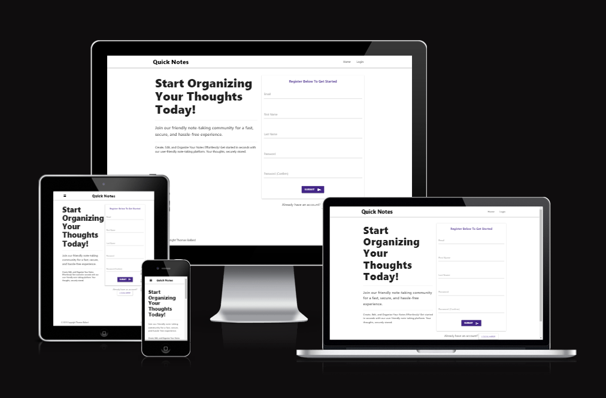

# QuickNotes

This Flask-based web application was developed to offer users a swift, simple, efficient, and secure online platform for storing notes.

[View the Live project here](https://quicknote-milestone3-ci-b9aeeb595db7.herokuapp.com/)

## Table of Contents
1. [User Experience](#user-experience)
2. [Features](#features)
3. [Design](#design)
4. [Technologies Used](#technologies-used)
5. [Deployment and Local Development](#deployment-&-local-development)
6. [Testing](#testing)
7. [Credits](#credits)

## User Experience

### Key information for the site

* Create a unique account and securely save notes.
* Allows users to create, view, edit, and delete notes that are specific to them at any time.
* Notes are sorted by the newest or most recently edited, from top to bottom, based on date and time.
* Accessible on multiple devices via the device's web browser (Desktop, Tablet, and Mobile) to access notes while on the move.

### User Stories

#### Client Goals

* To create, edit, view, delete, and store notes easily and quickly.
* To be able to view notes on multiple platforms.

#### First Time Visitor Goals

* To be able to easily create an account and create their first note.
* To understand how to edit and delete the users' notes.
* To be able to quickly and easily view their notes.
* To be able to easily understand how to delete their account if needed.

##### Returning Visitor Goals

* To be able to return to the site to view, edit, and delete their notes.
* To be able to delete their account and notes if they wish.

## Features

### Existing Features

- __Landing/Welcome Page__

  - The welcome page is designed to provide the user with a brief summary of the app and a clear registration form to sign up directly from the page or click the 'Login!' link to log in to an existing account.

- __Notes Page__

  - The Notes page is designed to provide the user with a clear and easily accessible button for creating a new note. Once the notes are created, they are displayed to the user within a collapsible element. This display includes the note's title and creation date, allowing the user to expand their preferred note for editing, deletion, or viewing its contents. This design aims to maximize the efficient use of the available screen space.

- __Edit Note Page__

  - The Edit page is designed to enable the user to edit the title and content of a chosen specific note, updating the existing note and moving it to the top of the notes page.

- __Delete Notes__

  - The 'Delete Notes' button opens a modal to prompt user confirmation for deletion, ensuring a reduction in accidental deletion of notes.

- __Account Page__

  - The Account page is a simple interface that allows the user to delete their account and the corresponding notes. It provides straightforward instructions, a warning, and two buttons: 'Back to Notes' and 'Delete Account.' When the user selects 'Delete Account,' a confirmation modal will appear to reduce the risk of accidental deletion before the account is permanently removed. The 'Back to Notes' button, alternatively, directs the user back to their notes page.

- __Modals__

  - Modals are used to confirm user actions, serving to reduce the likelihood of accidental actions by the user. They are implemented for functions such as note deletion, account deletion, and logging out.

### Future Features

- __Search Notes__

  - Given additional time or as an update to the app, I believe a valuable addition would be to grant users the ability to search their notes using keywords. This feature would greatly assist in easily locating specific notes, especially for users managing a large volume of stored notes.

- __Set Notes to Important__

  - Given more time or as an update to the app, I believe that enabling users to mark and set notes as important, always displaying them at the top, would greatly enhance the app's value and user experience.

## Design

### Initial Concept
The primary design concept aimed to create a clear and easily readable website with high contrast. It includes a splash of colour for highlighting key points and buttons, providing users with a clean, crisp, and easy-to-navigate experience.

### Colour Scheme
The chosen neutral colour scheme of whites and blacks, along with drop shadows, and the use of Indigo for action buttons and links, was selected to improve visual clarity while maintaining a clean and modern aesthetic.

### Typography
["Roboto"](https://fonts.google.com/specimen/Roboto) The font is the default font used by Materialize CSS. It is a modern, easily readable, and widely used typeface.

### Wireframes

#### Welcome/Home Desktop

#### Welcome/Home Mobile and Tablet

#### Notes Desktop

#### Notes Tablet and Mobile

#### Add Note/Edit Note Desktop

#### Add Note/Edit Note Mobile and Tablet

#### Login Desktop

#### Login Tablet and Mobile

#### Account Desktop

#### Account Tablet and Mobile

### Finalised Design

#### Home

#### Login

#### Notes

#### Add Note

#### Edit Note

#### Account

#### Delete Note Modal

#### Delete Account Modal

#### Logout Modal

## Technologies Used

### Languages Used

- [HTML5](https://en.wikipedia.org/wiki/HTML5)
- [CSS3](https://en.wikipedia.org/wiki/Cascading_Style_Sheets)
- [Java Script](https://en.wikipedia.org/wiki/JavaScript)
- [Python](https://developer.mozilla.org/en-US/docs/Learn/CSS/CSS_layout/Flexbox)

### Frameworks, Libraries & Programs Used

- [Materialize CSS:](https://materializecss.com/) A modern responsive front-end framework based on Material Design.

- [Gitpod.io](https://code.visualstudio.com/) Used to write the website code.

- [GitHub:](https://www.github.com/) Used as the repository for the project's code after being pushed from Gitpod.io.

- [Adobe XD](https://www.adobe.com/creativecloud.html) Used to create the wireframes during the design process.

- [Flask](https://flask.palletsprojects.com/en/3.0.x/) Flask is a lightweight and flexible web framework written in Python. It is designed to make building web applications and APIs straightforward and easy. Flask provides the tools and libraries that allow developers to create web applications without the need for complex setups. It is known for its simplicity, extensibility, and ease of use, making it a popular choice for developing web applications in Python.

- [Jinja](https://jinja.palletsprojects.com/en/3.1.x/) As template engine.

- [SQLAlchemy](https://www.sqlalchemy.org/) SQLAlchemy is the Python SQL toolkit and Object Relational Mapper that gives application developers the full power and flexibility of SQL. It provides a full suite of well known enterprise-level persistence patterns, designed for efficient and high-performing database access, adapted into a simple and Pythonic domain language.

- [Heroku](https://www.heroku.com) For deployment.

- [ElephantSQL](https://www.elephantsql.com/) For Database management.

- [Google Dev Tools](https://developer.chrome.com/docs/devtools/) For troubleshooting, testing features and solving issues with responsiveness and styling.

- [Am I Responsive?](https://ui.dev/amiresponsive) To show the website image on a range of devices.

### Data Schema

## Deployment & Local Development

### Deployment

This project was deployed to GitHub Pages using the following steps:

1. Log into GitHub and locate the [GitHub Repository](https://github.com/ThomasBallardCI/M2-Skate-Selection-Quiz).
2. Click the settings button (above the "add file" button).
3. Click on "Pages" on the left-hand-side column.
4. Under "Source", click the dropdown called "Main", select folder ""/root" and click "save".
5. Refresh the page.
6. Click on the "Visit site" button at the top of the page.

### Local Deployment

#### How to Fork

To fork the Brain Worms repository:

1. Log in (or sign up) to GitHub.
2. Go to the repository for this project, at [GitHub Repository](https://github.com/ThomasBallardCI/M2-Skate-Selection-Quiz).
3. Click the Fork button in the top right corner.

#### How to Clone

To clone the Brain Worms repository:

1. Log in (or sign up) to GitHub.
2. Go to the repository for this project, at [GitHub Repository](https://github.com/ThomasBallardCI/M2-Skate-Selection-Quiz).
3. Above the list of files, click "Code".
4. Click "Open with GitHub Desktop" to clone and open the repository with GitHub Desktop.
5. Click "Choose..." and, using Windows Explorer, navigate to a local path where you want to clone the repository.
6. Click "Clone".

## Testing

Testing was an ongoing process as I built out the questionnaire, utilizing Chrome Developer Tools with console logging to ensure I was getting the required responses from the code as it was written.
There are two types of testing methods available: 'Manual' and 'Automated.' Both have been used in some form throughout the creation of the website questionnaire.

- __Manual Testing__ Is done by an individual to see if they can use the product in a way that creates, finds, and results in bugs, or not, to ensure it behaves correctly for the user when pushed live.

- __Automated Testing__ Is done by means of an automation framework or another tool or software suite to check for errors and bugs in code.

### Solved Bugs

- The hover effect was persistent across mobile and tablet devices and remained on the previously selected option during the questionnaire.

  - Fix: Used a media query (Pointer: fine) with the hover styling placed in to only target devices with an accurate pointer (like a mouse or stylus).

- The Name Input field allowed non-alphanumeric values.

  - Fix: Added code to JS to check that the user inputs only alphanumeric characters into the name field and, if not, alerts the user to provide a name containing them.

- The background blur was not applying on iPad OS/Safari browser.

  - Fix: Added a -webkit- CSS line to specifically target Safari and apply the blur.

### Known Bugs

- Firefox is not displaying the 'Manrope' font correctly and defaulting to sans-serif. Unsure of the reasoning and due to time constraints, could not find and implement a fix in time for submission.

### Validator Testing

#### [HTML Validator](https://validator.w3.org/)

  - __Result for Index.html (Whole site HTML)__

    Two warnings appear for the H1 and H2 headings. This is the result of those headings being populated by JS rather than HTML directly.
    

#### [CSS Validator](https://jigsaw.w3.org/css-validator/)

  - __Results for Style.css__

    

#### [Lighthouse Validaton](https://developer.chrome.com/docs/lighthouse/overview/)
  
  - __Desktop__

    

  - __Mobile__

    

#### [JSLint](https://jslint.com)

  - __Data.js__
    
    

  - __Sctipt.js__
    I added "document, alert, location" to the imported globals field due to them being provided by the browser environment. I also added "question and skateSuggest" as they are in the data.js file. I instructed it to allow whitespace for preference on how the code looks for readability, as well as length due to comments being longer than 80 characters.
    

### Manual Testing

All manual testing was carried out by myself and a few friends on various devices and browsers.

__Desktop__
- Chrome Version 114.0.5735.199 (Official Build) (64-bit)
- Firefox Version 115.0.2 (64-bit)
- Microsoft Edge4 Version 114.0.1823.82 (Official Build) (64-bit)

__Mobile__
- Samsung Galaxy S21+
- One UI Version 5.1/Android 13
- Chrome Version 114.0.5735.196

__Tablet__
- Apple Ipad Pro 13" 2021 - iPadOS Version 16.5.1
- Safari Version 16.0

### Test Cases and Results
  - Chrome Developer tools were used to fully test the site and its functionality throughout the development process, in combination with console logs as code was written, to ensure it was functioning correctly. The Chrome Developer tools were also used to test responsiveness for mobile and tablet device-specific styling before moving on to functionality testing on those devices physically.

#### Button
  - Testing of all buttons was carried out on all platforms to ensure they took you to the relevant next section, checked and logged the information required correctly or restarted the quiz entirely, with the questionnaire buttons being checked in all 27 possible combinations.

#### Input Field
  - Testing of the input field was done by passing it non-alphanumeric values at various stages of the 'Names' characters during input to ensure the code would trigger and send an alert to the user, notifying them that only alphanumeric characters are permitted.
  - Testing of the name being logged for use when the begin quiz button was pressed and the user had used only alphanumerical characters between 2 and 30 characters long was done via the Chrome DevTools and console logging the value pushed to the username variable.

## Credits

- [Locoskates.co.uk](https://Locoskates.co.uk) For the resized marketing images of the inline skates used.

- [Caniuse.com](https://caniuse.com/css-backdrop-filter) For CSS Backdrop filter compatibility with Safari.

- [StackOverFlow](https://stackoverflow.com/questions/73967974/disable-css-hover-when-touch-end-in-touch-device) To block the hover effects on mobile and tablet devices.

- [StackOverFlow](https://stackoverflow.com/questions/13183421/how-to-change-placeholder-color-on-focus) Changing placeholder font colour for input field.

- [Geeksforgeeks](https://www.geeksforgeeks.org/what-is-mouse-down-selector-in-css/) Creating a 'pressed in' effect on button press for desktop.

- [Plainenglish.io](https://javascript.plainenglish.io/how-to-get-the-id-of-the-clicked-element-in-the-javascript-click-handler-8ca398d848d6) For help with initially getting the ID of the question button selected by the logged-in user.

- [W3Schools]( https://www.w3schools.com/css/css3_flexbox.asp) For help with Flexbox. 

- [W3Schools](https://www.w3schools.com/tags/att_input_type_submit.asp) Help with submit button.

- [W3Schools](https://www.w3schools.com/css/css_form.asp) Text area styling for user name input field 

- [W3Schools](https://www.w3schools.com/jsref/met_win_alert.asp) Alerting user to incorrect name input.

- [Flexiple.com](https://flexiple.com/javascript/javascript-capitalize-first-letter/) Forcing user input to be uppercase on the first letter, regardless of the user's input when called on the results page.

- [Shecodes.io](https://www.shecodes.io/athena/8931-creating-a-string-with-variables-in-javascript) Help with stringing together username and results information on the results page.

- [educba](https://www.educba.com/clear-cache-javascript/) Help with clearing the username and stored results upon restart after clearing the cache.

Massive thanks to my tutor, Elaine Roche, for helping with suggestions for the code for the next question function to work correctly and checking user input is alphanumeric, as well as all the other support and brainstorming on ideas.

Massive thanks to my September 2022 Cohort group for helping with testing and peer reviewing my code.